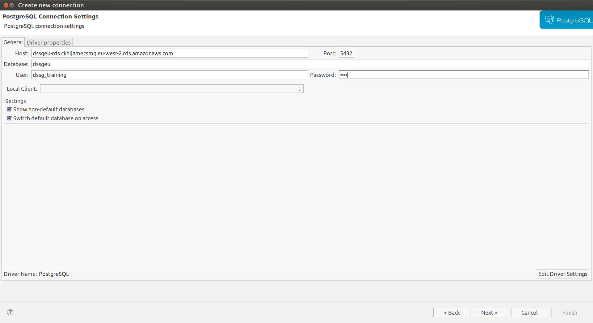
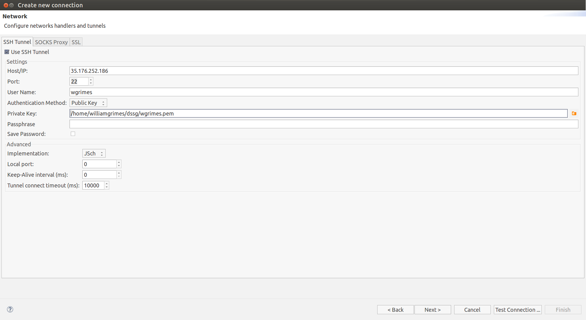

# SSH and the Cloud
Cloud computing is a computing paradigm popularised by Amazon, which enables access over the internet to shared pools of configurable system resources and higher-level services that can be rapidly provisioned with minimal management effort. Cloud computing relies on sharing of resources to achieve coherence and economies of scale. 

Each of you has been assigned an individual account that gives you access to Amazon Web Services (AWS), try logging into the portal:

**AWS portal:** [login link](https://dssg-europe.signin.aws.amazon.com/console) <br/>
**Username:** _firstinitial + lastname_ (e.g. Alice Smith becomes asmith) <br/>
**Password:** &ast;&ast;&ast;&ast;&ast;&ast;&ast; (you will be asked to change the password upon the first login) <br/>


AWS is one of the most popular cloud based computing services, along with Microsoft's Azure, and IBM Bluemix. These services offer multiple services and their capabilities are being extended all the time. For your projects the most important things to be aware of are:

* **Amazon Elastic Compute Cloud (EC2)** - these so called EC2 instances allow users to rent virtual computers on which to run their applications. EC2 encourages scalable deployment of applications. A user can create, launch, and terminate server-instances as needed, paying by the second for active servers – hence the term "elastic". EC2 provides users with control over the geographical location of instances that allows for latency optimization and high levels of redundancy.

* **Amazon Elastic Block Store (EBS)** - acts like a virtual hard drive and can be used with EC2 instances in the AWS cloud. When you require more storage or storage that persists beyond the life of the EC2 instance, the EBS can be utilised. The data is separate from your computing instance and persists independently so that if a computing instance fails, you will not lose data as it is located on the block storage volume. There are three volume types offered through EBS: general purpose (SSD), provisioned IOPS (SSD) for intensive I/O, and magnetic for rarely accessed data.

* **Amazon Simple Storage Service (S3)** - a highly scalable object storage that is suited to both small and large repositories of objects. The low cost service can be utilized for online backup and archiving of data and application programs and for content distribution as well as for big data analytics and disaster recovery. Storage is available in the form of any file or object and supports downloading, uploading and storage from across the web.

* **Amazon Relational Database Service (RDS)** - is a distributed relational database service designed to simplify the setup, operation, and scaling of a relational database for use in applications.

* **Amazon Lambda Service (Lambda)** - AWS Lambda lets you run code without provisioning or managing servers. there is no charge when your code is not running. There is no servers - Ideal for micro-service architectures.

- Typically a team will be given a shared EC2 instance to use for development with an associated EBS; 
- data from project partners will be dumped into an S3 bucket. 
- Usually this will be loaded into an RDS to improve query performance and create a single shared data repository, with a backup of the raw data in the S3 bucket. 
- Using these tools along with Git allows for greater collaboration, computing scalability, and security!

# Secure Shell (SSH) 
SSH can be used to access cloud services on AWS providing a secure channel over an unsecured network in a client-server architecture. This allows you to connect from your laptop to an EC2 instance and write and execute code remotely.

## Note on SSH key management
On Unix-like systems, the list of authorized public keys is typically stored in the home directory of the user that is allowed to log in remotely, in the file `~/.ssh/authorized_keys`. This file is respected by SSH only if it is not writable by anything apart from the owner and root (`chmod 600`). When the public key is present on the remote end and the matching private key is present on the local end, typing in the password is no longer required. However, for additional security the private key itself can be locked with a passphrase.


`chmod 600` means 

> give the following authorizations to this file: 110 000 000 

Here's a nice slide explaining that:


The private key can also be looked for in standard places, and its full path can be specified as a command line setting (the option -i for ssh). The ssh-keygen utility produces the public and private keys, always in pairs.

SSH also supports password-based authentication that is encrypted by automatically generated keys. In this case, the attacker could imitate the legitimate server side, ask for the password, and obtain it (man-in-the-middle attack). However, this is possible only if the two sides have never authenticated before, as SSH remembers the key that the server side previously used. The SSH client raises a warning before accepting the key of a new, previously unknown server. Password authentication can be disabled.


**github and other versioning systems where data is dependent on the machine also use regularly public key exchanges to avoid passwords**


## Exercises

Let's get data from several places and make a file called `answers.md` with all results (label them with the of the step). 

This is something you should submit at the end of the session, to this repo to 

`dssg-europe-syllabus/03_TERMINAL_ssh_and_the_cloud/exercises/[your_username]/answers.md`

(We will use this method in several sessions)

### Connection to S3

1. Login to the AWS EC2 training instance:

`ssh -i /path/key.pem username@35.176.252.186`

2. Get some data from a S3 server

Be sure you can use S3 CLI:

- Start by configuring your amazon CLI using this page: https://docs.aws.amazon.com/cli/latest/userguide/cli-config-files.html

- Don't forget to use the credentials given to you: Access key ID and Secret access key

At the end you should be able to make 

```bash
aws s3 ls
```

and see 1 bucket there. Create a folder in your home like `~/my_bucket`, navigate to it, and try to run

```bash
aws s3 cp s3://dssg2018-general/text_to_fellows.txt my_bucket/
```

Careful with your aws zone, solve all issues until you can synchronize the bucket.

Pick up the text in the file and add that to the `answers.md`. (Label 2.) 

### psql CLI

3. Login psql with your `username` and `pass`. We have set passwords to everyone to connect to training with the same user.

**user:** dssg_training
**password:** dssg

in your training VM, 

```
psql -h dssgeu-rds.ckhljamecsmg.eu-west-2.rds.amazonaws.com -U [USER] -d dssgeu 
```

then add the the [password]


4. Check the names of the databases using and add to the `answers.md` the names of the databases your seeing

`\l`

5. Pick the Database `dssgeu` and see the `raw` schema tables, using
``` 
\c dssgeu

\dn
``` 

Pick the names of the first schema you're seeing and add to the `answers.md` with (label 3)

(by the way, leave with `\q`. Know more with http://www.postgresqltutorial.com/psql-commands/)

### DBeaver

5. create a DBeaver connection to that DB Server

We should now connect DBeaver to the Database - you can still do everything using 





(or similar)

6. Check if the same first schema added before is there

7. Add a screenshot file named with your name, with the DBeaver showing the Databases to the Repo and push it.

