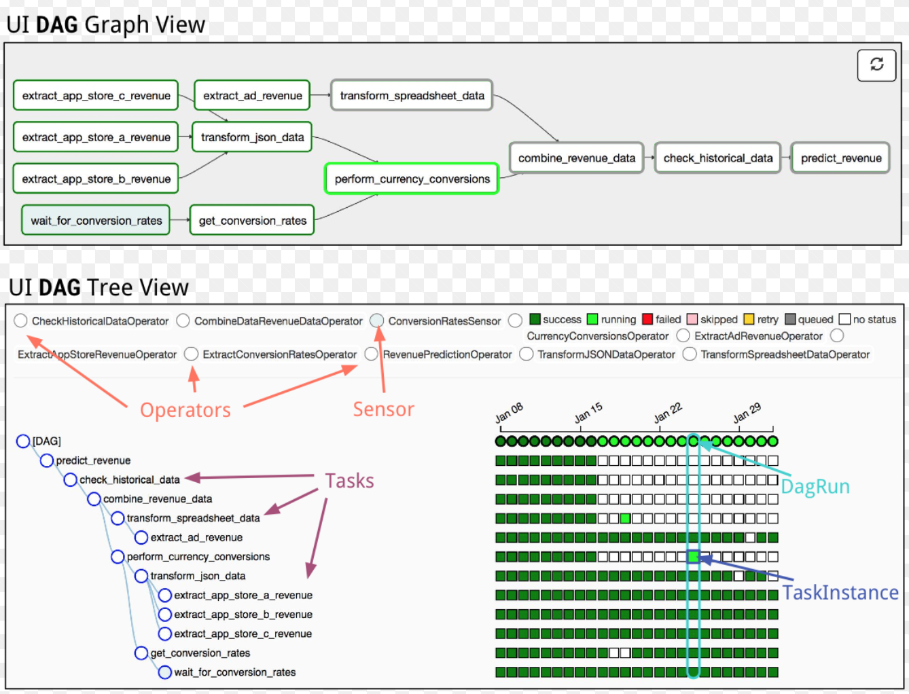
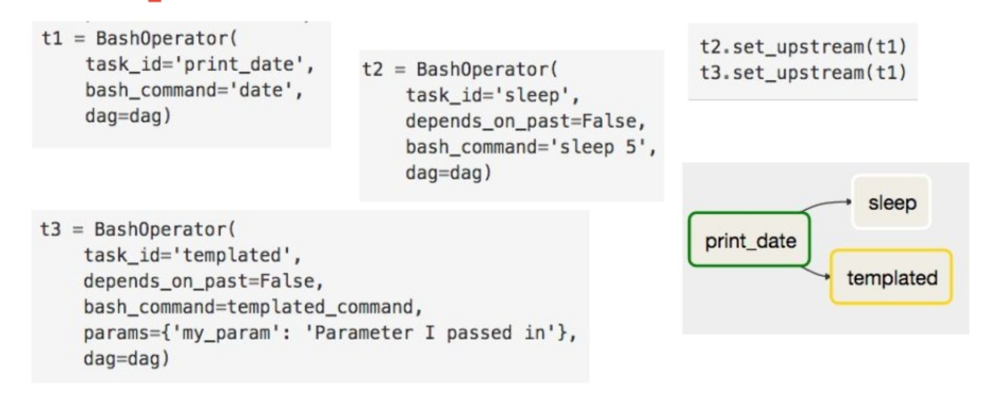
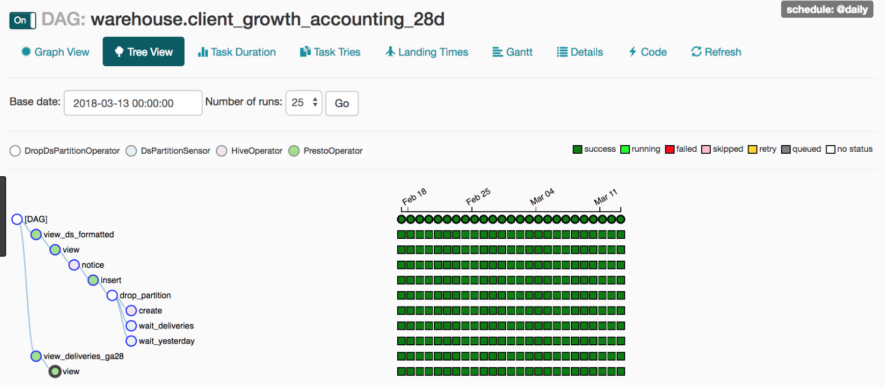
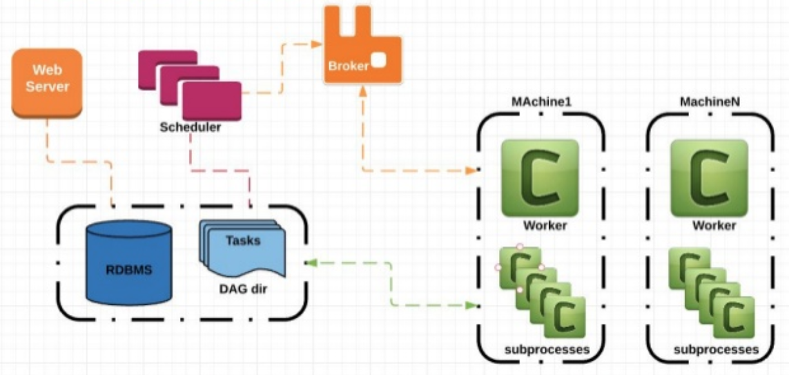

# From Research to Production Pipelines

---

# From Research to Production Pipelines


## We now have a pipeline to improve models

### We can now automate processes like:

- create train/test splits; 
- choose features and labels;
- define what rows to use;
- choose methods to run;
- measure impact of feature groups;
- create a loop for hyperparams/“other options” changed for several trainings;

GREAT!


---


# What is missing for production?
---


# What is missing for production?

- Get a adapted model for partner context;
- Have a way to deploy your model for instance through an API or using a Web Page
- Make sure your model deploy is controlled and doesn't disrupt things - **IEFP example**! 

Anything else?

- **Feed-in new data** - Generate a periodic or real-time data feed using some kind of workflow system

---

# Why a Workflow?

**A workflow is a scheduler and a graph dependency executor**

If we are feeding one simple "static" model, we can actually make a chron job for running our ETL project... but anything more complex will be problematic.

### A production environments normally feed:

- BI Systems
- Several models
- Automated Testing over data 
- Automatic assessment of model performance including new data

---

# We need then a Workflow system that allows for

- **Scheduling** - periodic/on demand (smart) data processing through the pipe 

- **Scaleability and Backfilling** - Easily add new features and backfill data.

- **Fallbacks and Fail Awareness** - emails for failing processes; repeatability of blocking processes.

- **Distributed Processing** - e.g. use queues to process data like Celery

---

# Options for Production ETL/Workflows

	- Luigi  - Spotify open source solution 
	- AirFlow - Airbnb (now apache open source) solution
	- Pinball - Pinterest open source solution


---

# Airflow - Creating DAGs

- What is a DAG

---




---
# Simple DAG Example



---

# Airflow Most important features
	
- Composed of tasks, made by operators (classes) that could be anything, from bash calls, python or SQL queries;
- DAGs have no cycles; 
- No task execution before all inputs are available (workflow logic);
- Distributed execution using workers;
- Partitioning work by a specific field
- Data Partitioning using Datestamp
- Data Backfilling - hability to rebuild all, using new 
- Sensors or Schedulers
	
---

# Create and running a DAG 

```
default_args = {
    'owner': 'airflow',
    'depends_on_past': False,
    'start_date': datetime(2015, 6, 1),
    'email': ['airflow@example.com'],
    'email_on_failure': False,
    'email_on_retry': False,
    'retries': 1,
    'retry_delay': timedelta(minutes=5),
    # 'queue': 'bash_queue',
    # 'pool': 'backfill',
    # 'priority_weight': 10,
    # 'end_date': datetime(2016, 1, 1),
}
```

- Test a Task 

```
airflow test DAG_ID TASK_ID EXECUTION_DATE
```

- Make a BackFill

```
airflow backfill DAG_ID TASK_ID -s START_DATE -e END_DATE
```

---

# run a dag in production




---
### More complex, Distributed ways of running DAGs




---

## How to incorporate this into DSSG

#### If your project needs or will need to include periodic, automated data integration 

- Use airflow (or similar) to make a future roadmap for your project;

or 

- Create a first DAG that incorporates all your ETL and pipeline until data is created;

also 

- You can also add training and test if needed; 
- Be sure new models are deployed after results are compared with previous models;


---
# Extras 

- Remote connection to your (Python) files  ([click here](https://github.com/dssg/wiki/wiki/Remotely-editing-text-files-in-your-favorite-text-editor))


---

# Extras 

## Small Explanation about Incoming Code Review Process

- **git repository:** structure, readme, documentation, installation, requirements, etc.
- **modularity of the overall pipeline:** external pipeline library, please - I have been enforcing this, we should be very clear on this
- **repeatability:** Be sure your initial ETL is also a part of the pipeline - include bash and SQL in a structure that can be easily called several times, not just the “config.py” - it doesn’t have to be inside the config.py but it can.

---

# Extras 

## Small Explanation about Incoming Code Review Process

- **generalizability:** config.py should be at least dealing with this: 

	- create train/test splits; 
	- choose features and labels 
	- define what rows to use
	- choose methods to run;
	- create a loop for hyperparams/“other options” change around several trainings
	
- **data science pipeline**
	- sql vs pandas, scalability, database operations (minimizing updates, alter tables, etc.), parallelization, config files


