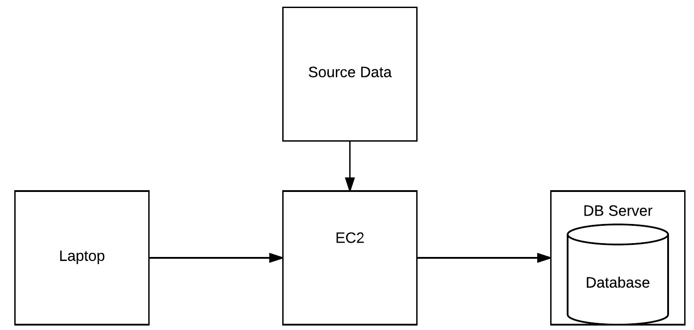

# Overview and Software Setup

This repository contains teaching resources that we will use over the fellowship. It is supplementary to the [DSSG Hitchiker's Guide](https://github.com/dssg/hitchhikers-guide) and heavily sourced from it, which is an invaluable resource for doing any DSSG project. This repository is tailored specifically to the tutorials/classes we will be giving over the 2018 summer fellowship in Lisbon.

## Technical support:
* **Nuno Brás** - lead technical mentor
* **Qiwei Han** - technical mentor
* **William Grimes** - junior technical mentor
* **Iñigo Martínez de Rituerto de Troya** - infrastructure and technical support
* **João Fonseca** - infrastructure support

## Technical mentor’s role:
* Project mentor/consultant on technical side
* Core infrastructure maintenance (data, computing resources)
* Technical training/support

Ask us anything about technical stuff. We will try our best to help you address the difficulties or direct you to the right person whenever necessary.

## Local software setup for tutorials and projects
* SSH (PuTTY for Windows)
* Git (for version control)
* pSQL (PostgreSQL command line interface)
* IDE / text editor (Atom, Sublime, Vim, VS studio, PyCharm, Spyder, ...)
* [DBeaver](http://dbeaver.jkiss.org/)
* [Python 3.6](https://www.Python.org/downloads/)
* [miniconda](https://conda.io/miniconda.htML) or [pip/virtualenv](https://pip.pypa.io/en/stable/installing/)
* Python Packages
    * pandas/numpy/scipy
    * [matplotlib](https://matplotlib.org/)
    * [scikit-learn](http://scikit-learn.org)
    * [psycopg2](http://initd.org/psycopg/)
    * [iPython](https://iPython.org/)
    * [jupyter](http://jupyter.org/)

For more detail on the software setup have a look [here](https://github.com/dssg/hitchhikers-guide/tree/master/curriculum/0_before_you_start/software-setup).

Try it out!
You should give all installed software a quick spin to check that it did install. For your Python packages, try to import them. Type `Python` in your shell, and then once you are in your Python session, try for example `import numpy`, `import matplotlib`, and so on. (You can quit with exit().) Also try iPython and jupyter notebook in your terminal, and see if you get any errors.

## Working in the cloud
Project work over the summer will be done in a cloud computing environment, where each project will have a seperate server (AWS EC2 instance) as their main server for large-scale data processing tasks, and a database to securely store the data. This is advantageous since data is maintained in one place, teams can collaborate easily, and you have access to scalable computing resources.

Good news: DSSG is supported by Amazon Web Service Cloud Credits for Research program and Microsoft Azure for Research awards!
Amazon Web Service (AWS) https://aws.amazon.com/

Each fellow will be assigned a user account that allows you to make use of AWS service

## Checklist
1. Have all software installed, running, and tested locally
2. Have a Github account created
3. Join the two DSSG github organisations:
   * [DSSG Chicago](https://dssg-github-invite.herokuapp.com/) - input your github username at this link.
   * [DSSG Europe](https://github.com/DSSG-EUROPE) - you will have received an invite through e-mail.
4. Try to SSH into the training instance using your saved private key  
    `ssh -i ~/path/to/pemfile.pem username@35.176.252.186`

# Technical Syllabus

This summer we go through a set of modules that will help you starting and/or growing as DataScientists for Social Good. Each session is briefly identified in square brackets in the calendar, like

> [All] [TERMINAL] 1 command line basics

which means

> All to attend, Module TERMINAL, First lesson, about command line basics

### 1. Terminal Module

A set of lessons that introduce you and helps you to be productive while working in the terminal. This is specially important when working in virtual machines. The sessions are:

| Sessions | Week |
|:----:|----|
|Command line basics |w1|
|Software versioning with git |w1|
|SSH and the cloud |w1|
|git advanced |w3|

### 2. SQL Module

A set of lessons to make you dominate simple and advanced SQL (PostGres) and also some relevant database concepts.

| Sessions | Week |
|:----:|----|
| SQL basics |w1|
| SQL advanced |w3|
| Databases theory |w3|

### 3. Python Module

A module to make all on the same pace. We work with things like

- Dictionaries and other structures
- Functions, Classes and Objects, numpy, matplotlib
- Python Code best practices

| Sessions | Week |
|:----:|----|
| Python beyond scripting |w2|

### 4. Data Module

Handling of data using Pandas; feature extraction, transformation, selection;

| Sessions | Week |
|:----:|----|
| Feature engineering |w4|

### 5. Machine Learning Module

From general introduction to machine learning concepts up to a set of algorithms adapted to your problems.

| Sessions | Week |
|:----:|----|
| ML intro |w3|
| Quantitative Social Science |w4|
| Causal inference |w4|
| ML models 1 |w4|
| ML models 2 |w6|

### 6. ETL Module

How to bring data science solutions to production architectures. Workflows and data streamings; Data Warehouses and Data Lakes.

| Sessions | Week |
|:----:|----|
| csvtodb and other simple data handling |w2|
| DAGs and other workflow systems |w5|

---

## Final Syllabus

| Modules | Sessions | Week |
|----|----|----|
| TERMINAL | Command line basics |w1|
| TERMINAL | Software versioning with git |w1|
| TERMINAL | SSH and the cloud |w1|
| SQL | SQL basics |w1|
| PYTHON | Python beyond scripting |w2|
| ETL | csvtodb and other simple data handling |w2|
| TERMINAL | git advanced |w3|
| SQL | SQL advanced |w3|
| SQL | Databases theory |w3|
| ML | ML intro |w3|
| DATA | Feature engineering |w4|
| ML | Quantitative social science |w4|
| ML | Causal inference |w4|
| ML | ML models 1 |w4|
| ETL | DAGs and other workflow systems |w5|
| ML | ML models 2 |w6|

---

## Extra: Special Sessions

- This sessions should be given in order to fulfill lack of knowledge in specific areas that could make a huge difference to some groups;
- They are not compulsory.
- They actually can be given by fellows!

here are some examples:

| Special Sessions |
|----|
| Web Scrapping |
| GIS analysis |
| Network Analysis |
| Text Analysis |
| Record Linkage |
| Optimization |
